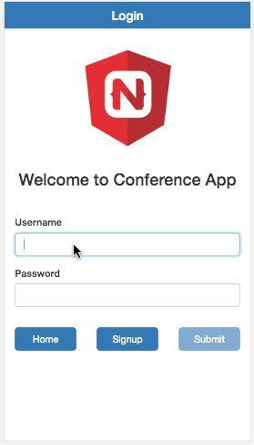
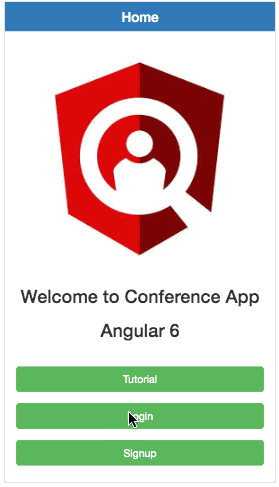
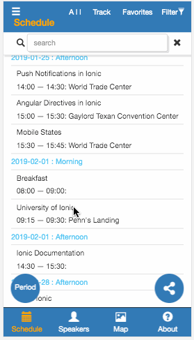

# NgConferenceApp

This project was generated with [Angular CLI](https://github.com/angular/angular-cli) version 6.2.1.

## Description

&nbsp;
### Admin Event Publishing

&nbsp;
 
Anyone can use this app after signup and login with their own username and password. By detecting username, two different dropdown menu and group of tabs are opened. Only ‘admin’ can update and save all data such as Events, Speakers, Tasks, and Locations into the firebase database and storage.
    
&nbsp;
I used two group of routing modules, app-routing module and setup-routing module. By using lazy loader, the setup-routing module will be called saferately from the app-routing module only when admin login this app. So the setup-routing module won’t be loaded when the genreal user login this app because the setup-routing module is lazy.
 
 
 
 
 
 

&nbsp;
### Event Schedule Pull

&nbsp;
 
All data - all events in the certain period, speakers, tracks, locations and user’s favorite list - will be retrived from the firebase database and storage when someone login successfully. And then the schedule will be generated by the built format to display as you see on right side.

User can find special events by searching the title. Whenever user input a keyword in the search bar, the schedule list will be updated with the keywords and user can approach easily to the taget event.

User can make different group of the schedule by selecting only one track or favorites, by resetting filter of tracks and by changing the repoet period.

If user wants to navigate more detail of a event, user can open any event which they want by selecting an event. 

 
 

&nbsp;
### Event Map Integration
 
 
 
 
 
 
 
 
 
 
 
 
 
 
 
 
 
 

## Deploy

http://conference-app-hogu.s3-website-us-east-1.amazonaws.com

## Development server

Run `ng serve` for a dev server. Navigate to `http://localhost:4200/`. The app will automatically reload if you change any of the source files.

## Code scaffolding

Run `ng generate component component-name` to generate a new component. You can also use `ng generate directive|pipe|service|class|guard|interface|enum|module`.

## Build

Run `ng build` to build the project. The build artifacts will be stored in the `dist/` directory. Use the `--prod` flag for a production build.

## Running unit tests

Run `ng test` to execute the unit tests via [Karma](https://karma-runner.github.io).

## Running end-to-end tests

Run `ng e2e` to execute the end-to-end tests via [Protractor](http://www.protractortest.org/).

## Further help

To get more help on the Angular CLI use `ng help` or go check out the [Angular CLI README](https://github.com/angular/angular-cli/blob/master/README.md).
